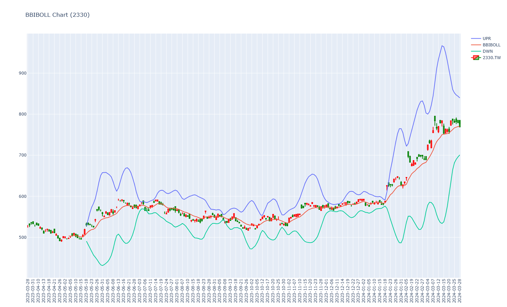
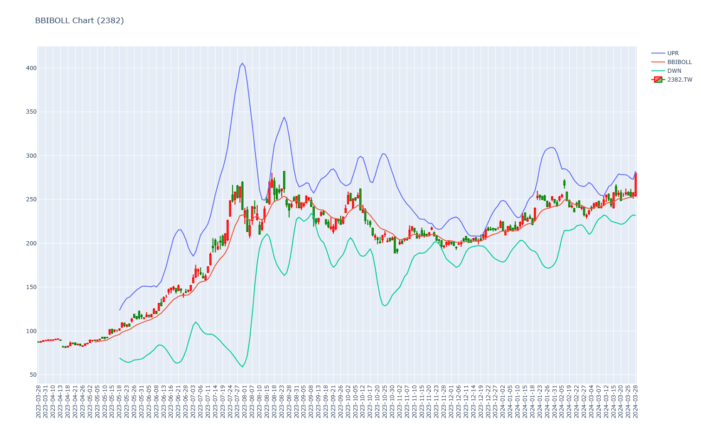
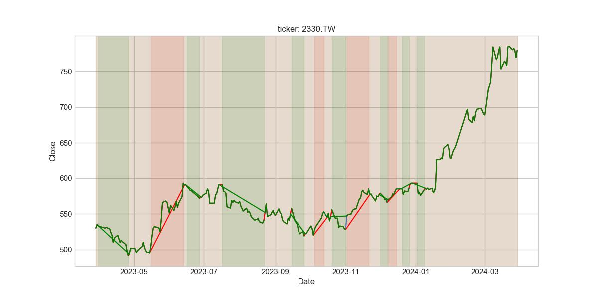

Table of Contents
=================
   * [Purpose](#purpose)
   * [StockInsider](#stockinsider)   
      * [Usage](#usage)
         * [1. Create Virtual Environment](#1-create-virtual-environment)
         * [2. Active Virtual Environment](#2-active-virtual-environment)
         * [3. Install packages](#3-install-packages)
         * [4. Edit conf.json](#4-edit-conf.json)
         * [5. Excute Python Sample Code](#5-excute-python-sample-code)
      * [2330 BBIBOLL](#2330-bbiboll)
      * [2382 BBIBOLL](#2382-bbiboll)
      * [Reference](#reference)
      * [Troubleshooting](#troubleshooting)
   * [trendet](#trendet)   
      * [Usage](#usage-1)
         * [1. Create Virtual Environment](#1-create-virtual-environment-1)
         * [2. Active Virtual Environment](#2-active-virtual-environment-1)
         * [3. Install packages](#3-install-packages-1)
         * [4. Edit conf.json](#4-edit-conf.json-1)
         * [5. Excute Python Sample Code](#5-excute-python-sample-code-1)
      * [2330](#2330)
      * [Reference](#reference-1)
      * [Troubleshooting](#troubleshooting-1)

   * [Reference](#reference-2)
   * [Troubleshooting](#troubleshooting-2)
   * [h1 size](#h1-size)
      * [h2 size](#h2-size)
         * [h3 size](#h3-size)
            * [h4 size](#h4-size)
               * [h5 size](#h5-size)


Created by [gh-md-toc](https://github.com/ekalinin/github-markdown-toc)

# Purpose  
Take note of Chart Trend

# StockInsider  

## Usage  
### 1. Create Virtual Environment  
```
 c:/Python310/python.exe -m venv c:\Users\XXXXX\Envs\chart_trend  
```

### 2. Active Virtual Environment
```
c:\Users\XXXXX\Envs\chart_trend\Scripts\activate.bat
```

### 3. Install packages
```
pip install -r requirements.txt
```

### 4. Edit conf.json 
```
{
    "stock_indexes": ["2303",
                       "2330" 
    ], 
    "twse_otc_id_pickle":"xxxxx.pickle"
}
```

### 5. Excute Python Sample Code
```
python test_bbibol.py --conf conf.json
```

## 2330 BBIBOLL  
   

## 2382 BBIBOLL  
  

## Reference
[charlesdong1991/StockInsider](https://github.com/charlesdong1991/StockInsider)  

## Troubleshooting  
[Plotly fig.to_image is stucking on windows 11. #126](https://github.com/plotly/Kaleido/issues/126)  
[Static image export hangs using kaleido](https://community.plotly.com/t/static-image-export-hangs-using-kaleido/61519)  
[v0.1.0.post1](https://github.com/plotly/Kaleido/releases/tag/v0.1.0.post1)  
```
Downloading and installing 0.1.0.post1 1.2k should work.
I downloaded this wheel:

kaleido-0.1.0.post1-py2.py3-none-win_amd64.whl

And then installed:
pip install kaleido-0.1.0.post1-py2.py3-none-win_amd64.whl
```


# trendet  
## Usage  
### 1. Create Virtual Environment  
```
 c:/Python310/python.exe -m venv c:\Users\XXXXX\Envs\chart_trend  
```

### 2. Active Virtual Environment
```
c:\Users\XXXXX\Envs\chart_trend\Scripts\activate.bat
```

### 3. Install packages
```
pip install -r requirements.txt
```

### 4. Edit conf.json 
```
{
    "ticker": "2330.TW",
    "up_trend_color": "red",
    "down_trend_color": "green",
    "images_folder":"xxxxx"
}
```

### 5. Excute Python Sample Code
```
python test_identify_chart_trends.py --conf config.json
```

## 2330
  

## Reference
[alvarobartt/trendet](https://github.com/alvarobartt/trendet)  

## Troubleshooting  


# Reference

# Troubleshooting


* []()  

  

# h1 size

## h2 size

### h3 size

#### h4 size

##### h5 size

*strong*strong  
**strong**strong  

> quote  
> quote

- [ ] checklist1
- [x] checklist2

* 1
* 2
* 3

- 1
- 2
- 3
