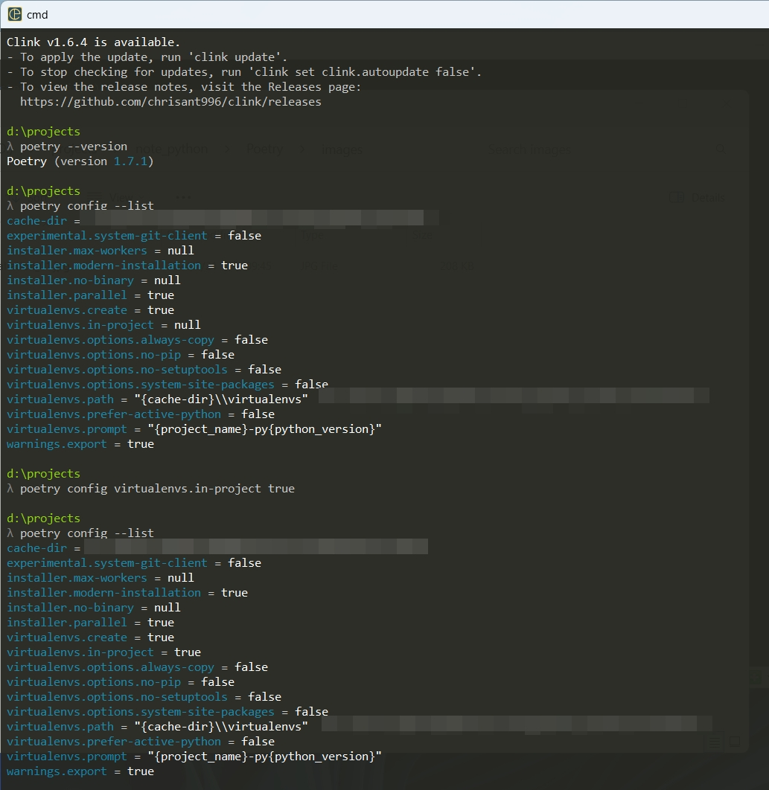

Table of Contents
=================

   * [Table of Contents](#table-of-contents)
   * [Purpose](#purpose)
      * [Installation](#installation)
      * [Example](#example)
   * [Use poetry for Hugging Face](#use-poetry-for-hugging-face)
      * [Installation](#installation-1)
      * [Example](#example-1)
   * [Reference](#reference)
   * [Troubleshooting](#troubleshooting)
      * [<a href="https://github.com/python-poetry/install.python-poetry.org/issues/112#issuecomment-1611536856">https://github.com/python-poetry/install.python-poetry.org/issues/112#issuecomment-1611536856</a>](#httpsgithubcompython-poetryinstallpython-poetryorgissues112issuecomment-1611536856)
   * [h1 size](#h1-size)
      * [h2 size](#h2-size)
         * [h3 size](#h3-size)
            * [h4 size](#h4-size)
               * [h5 size](#h5-size)

Created by [gh-md-toc](https://github.com/ekalinin/github-markdown-toc)


# Purpose
Take note of Poetry package related stuff


# Installation  
```
# Poetry install
$ curl -sSL https://install.python-poetry.org | python3 -

# Set the virtual env path to under the project directory
$ poetry config virtualenvs.in-project true --local

# Check the setup
$ poetry config --list

# Add pyproject.toml to an existing project
$ poetry init

# Add packages to Poetry
$ poetry add <Package name>
$ poetry add --group <Group name> <Package name>

# Install packages described in poetry.lock
$ poetry install

# Sanity check of pyproject.toml
$ poetry check

# Check the environment of poetry
$ poetry env info

# Build the package in PyPI
$ poetry build
$ poetry publish (-r <Repository name>)
```

## Example  
  


  

# Use poetry for Hugging Face  

## Installation  
```
poetry new huggingface_intro
cd huggingface_intro
```

```
poetry add transformers
```

```
poetry add torch torchvision
```

## Example  
```
poetry run python huggingface_intro/intro.py
```

```
tensor([[0.3915, 0.1245, 0.4840],
        [0.6033, 0.1590, 0.2377]], grad_fn=<SoftmaxBackward0>)
```

```
poetry run python huggingface_intro/hf_pipeline.py
```

```
d:\projects\note_python\Poetry\huggingface_tutorial\.venv\lib\site-packages\transformers\pipelines\text_classification.py:104: UserWarning: `return_all_scores` is now deprecated,  if want a similar functionality use `top_k=None` instead of `return_all_scores=True` or `top_k=1` instead of `return_all_scores=False`.

  warnings.warn(
[[{'label': 'positive', 'score': 0.3915075659751892}, {'label': 'neutral', 'score': 0.12451174110174179}, {'label': 'negative', 'score': 0.4839806854724884}], [{'label': 'positive', 'score': 0.6033188700675964}, {'label': 'neutral', 'score': 0.15902899205684662}, {'label': 'negative', 'score': 0.23765207827091217}]]
```


# Reference
[Poetry備忘録 2023-05-23](https://qiita.com/nabenabe0928/items/c8bbe8d26af13b0d10d1) 
[Python - 取代 Pipenv 的新套件管理器 Poetry 09 April 2021](https://note.koko.guru/posts/using-poetry-manage-python-package-environments)
[poetry add や poetry lock が終わらない時にやること 2023-12-03](https://qiita.com/f6wbl6/items/fbb6ae8283fc722be145)
[GeekFong/how_to_use_poetry](https://github.com/GeekFong/how_to_use_poetry?tab=readme-ov-file)  
[様々な条件下におけるPython開発環境の検討と構築 2023-12-20](https://qiita.com/legacsilve/items/d076cac36accbe2de647)  
[Windows で Python の開発環境を構築する（Poetry と pyenv を利用） 2023-11-03](https://qiita.com/kerobot/items/8b371ba51501ddc806a7)  
[VSCode + RemoteSSH + Poetry + JupyterNotebook 2023-02-13](https://qiita.com/ike1z/items/0f4e65fe340f84428af0)  
[PyTorch+CUDA+Poetry+Pyenvのコンテナ環境をVSCodeから作成する方法 2023-02-04](https://qiita.com/nyakiri_0726/items/a33f404b5e1be9352b85)  
[2022年度版Python環境構築徹底解説 2023-01-31](https://qiita.com/kjm_nuco/items/733d67ff39acb41839f2#poetry)  


[全端 LLM 應用開發-Day03-Poetry 入門 2023-09-18](https://ithelp.ithome.com.tw/articles/10322014)  
[全端 LLM 應用開發-Day04-Pyproject toml 詳解 2023-09-19](https://ithelp.ithome.com.tw/articles/10322133)
[全端 LLM 應用開發-Day05-Poetry 其他重要指令 2023-09-20 ](https://ithelp.ithome.com.tw/articles/10323102)
[全端 LLM 應用開發-Day08-Hugging Face 入門與 poetry 2023-09-23](https://ithelp.ithome.com.tw/articles/10325532)  
[全端 LLM 應用開發-Day09-Hugging Face 整合 FastAPI  2023-09-24](https://ithelp.ithome.com.tw/articles/10326325)  


# Troubleshooting
-----------------------------------
Error msg:
ssl.SSLCertVerificationError: [SSL: CERTIFICATE_VERIFY_FAILED] certificate verify failed: unable to get local issuer certificate (_ssl.c:1007)

https://github.com/python-poetry/install.python-poetry.org/issues/112#issuecomment-1611536856
-----------------------------------

[fdcastel/install-poetry](https://github.com/fdcastel/install-poetry) 


* []()  

  

# h1 size

## h2 size

### h3 size

#### h4 size

##### h5 size

*strong*strong  
**strong**strong  

> quote  
> quote

- [ ] checklist1
- [x] checklist2

* 1
* 2
* 3

- 1
- 2
- 3

No. | Test Name 
------------------------------------ | --------------------------------------------- | 
001 | Two Sum
