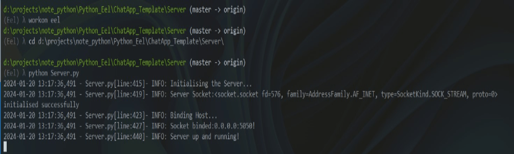

Table of Contents
=================

   * [Table of Contents](#table-of-contents)
   * [Purpose](#purpose)
   * [Python_weather_plotting](#python_weather_plotting)
      * [Installation](#installation)
      * [Usage](#usage)
      * [Reference](#reference)
   * [Chat-Bot](#chat-bot)
      * [Installation](#installation-1)
      * [Usage](#usage-1)
      * [Reference](#reference-1)
   * [Troubleshooting](#troubleshooting)
   * [Reference](#reference-2)
   * [h1 size](#h1-size)
      * [h2 size](#h2-size)
         * [h3 size](#h3-size)
            * [h4 size](#h4-size)
               * [h5 size](#h5-size)
   * [Table of Contents](#table-of-contents-1)

Created by [gh-md-toc](https://github.com/ekalinin/github-markdown-toc)


# Purpose
Take note of Python-Eel library related stuff

#  Python_weather_plotting

## Installation  
1. cd weather_plotting
1. /python.exe -m venv c:\Users\xxxxx\Envs\Eel
1. pip install -r requirement.txt

## Usage  
1. python Weather_request.py

  

## Reference  
[neutron0916/Python_weather_plotting](https://github.com/neutron0916/Python_weather_plotting)  


# Chat-Bot  

## Installation  
1. cd ChatApp_Template
1. /python.exe -m venv c:\Users\xxxxx\Envs\Eel
1. pip install -r requirement.txt

## Usage  
1. cd ChatApp_Template\Server
1. python Server.py
1. cd ChatApp_Template\Client
1. python Client.py

  

## Reference  
[AaronDcunha/ChatAppPythonTemplate ](https://github.com/AaronDcunha/ChatAppPythonTemplate)  
[Mahmoud-Hashad/Chat-App](https://github.com/Mahmoud-Hashad/Chat-App)    

# Troubleshooting


# Reference
[python-eel/Eel](https://github.com/python-eel/Eel#directory-structure)  
```
A little Python library for making simple Electron-like HTML/JS GUI apps 
```

[MrPowerUp82/Eel-MusicPlayer-Python ](https://github.com/MrPowerUp82/Eel-MusicPlayer-Python)

* []()  

  

# h1 size

## h2 size

### h3 size

#### h4 size

##### h5 size

*strong*strong  
**strong**strong  

> quote  
> quote

- [ ] checklist1
- [x] checklist2

* 1
* 2
* 3

- 1
- 2
- 3

No. | Test Name 
------------------------------------ | --------------------------------------------- | 
001 | Two Sum

